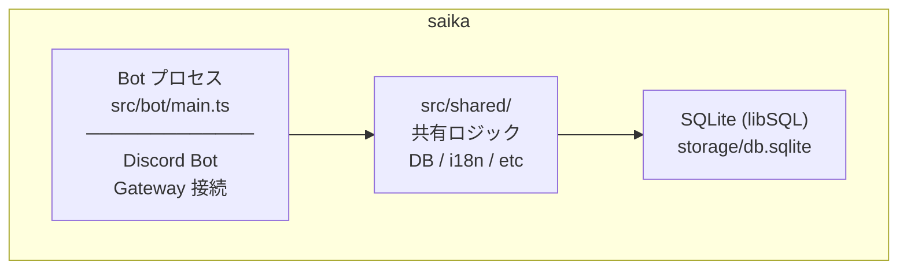

# アーキテクチャガイド

> Architecture Guide - コード設計・モジュール構成・設計パターンの解説

最終更新: 2026年5月29日

---

> **⚠️ 部分的に旧前提**
>
> 本ドキュメントは現行コード（SQLite / libSQL + Bot 単一プロセス）を記述しているが、以下は**移行予定**:
>
> - **DB を PostgreSQL に変更**（Coolify Scheduled Backups 対応・Bot 間の運用統一。決定済み・実装未着手）
> - **Fastify API 層を `src/api/` に追加**し、web ダッシュボードから設定 CRUD を受け付ける（Bot と同一プロセス内で起動）
> - ディレクトリ構成を `src/{bot,api,features,shared}/` 前提に再編
>
> プロジェクト全体方針は [infra/docs/PROJECT_ARCHITECTURE.md](../../../infra/docs/PROJECT_ARCHITECTURE.md) を参照。

---

## 概要

saika は **Discord サーバー管理 Bot** です。
Web UI は別リポジトリ（ayasono-web）に分離されており、本リポジトリは Bot プロセス本体と、web ダッシュボードから呼ばれる Fastify API サーバー（同一 Node プロセス内で起動、現在実装中）を担当します。

### このドキュメントのスコープ

- 扱う内容: システム全体の構成、依存方向、レイヤ境界、モジュール責務
- 扱わない内容: 関数分割手順、命名/コメント細則、実装時のチェックリスト
- 実装細則は [IMPLEMENTATION_GUIDELINES.md](IMPLEMENTATION_GUIDELINES.md) を参照

---

## プロセス構成



**起動コマンド**:

```bash
# 開発
pnpm dev

# 本番
pnpm start
```

---

## ディレクトリ構成

```
src/
├── bot/                       # Bot プロセス専用
│   ├── main.ts                # エントリーポイント
│   ├── client.ts              # BotClient クラス（discord.js Client 拡張）
│   ├── commands/              # スラッシュコマンド定義（自動スキャン）
│   ├── events/                # Discord イベントハンドラ（自動スキャン）
│   ├── features/<feature>/    # Bot専用機能（機能ごとにサブディレクトリ）
│   │   ├── commands/          #   コマンド実行ロジック
│   │   ├── handlers/          #   イベント境界・起動処理
│   │   │   └── ui/            #   Button/Select/Modal などUI境界
│   │   ├── services/          #   機能固有のビジネスロジック
│   │   ├── repositories/      #   機能固有のランタイムデータリポジトリ
│   │   └── constants/         #   共通定数・CustomID 定義
│   ├── handlers/interactionCreate/  # インタラクション振り分け
│   ├── shared/                # Bot 層内の複数機能で共用するユーティリティ
│   ├── errors/                # インタラクションエラーハンドリング
│   ├── utils/                 # Bot用ユーティリティ
│   └── services/
│       └── botCompositionRoot.ts  # Composition Root（全サービスの初期化・DI）
│
├── shared/                    # Bot・Web 両プロセスで使用する共有コード
│   ├── config/                # 環境変数定義（Zod バリデーション）
│   ├── database/
│   │   ├── types/             # ドメイン型・リポジトリインターフェース定義
│   │   ├── repositories/      # リポジトリ実装・シリアライザ
│   │   └── (各リポジトリにシングルトンゲッターを内包)
│   ├── errors/                # エラーユーティリティ・グローバルハンドラ（BaseError 階層は @ayasono/shared/core）
│   ├── features/<feature>/    # ギルド設定サービス（ConfigService + Defaults）
│   ├── locale/                # i18n（i18next）
│   ├── scheduler/             # JobScheduler（cron + setTimeout）
│   └── utils/                 # logger（@ayasono/shared/core の createLogger を wiring）, prisma, serviceFactory 等
│
```

### 設計原則

| ルール                                                          | 理由                                 |
| --------------------------------------------------------------- | ------------------------------------ |
| `src/bot/` → `src/shared/` への依存のみ許可                     | レイヤの疎結合を維持                 |
| `src/shared/` は `src/bot/` に依存しない                        | 共有コードの独立性を保証             |
| 共有可能な機能ロジックは `src/shared/features/<機能名>/` に配置 | 将来の API 公開時にも再利用可能      |
| Bot専用機能は `src/bot/features/<機能名>/` に配置               | Discord依存・Bot専用責務の混在を防止 |

命名規則・ディレクトリテンプレート・import 規約の詳細は [IMPLEMENTATION_GUIDELINES.md](IMPLEMENTATION_GUIDELINES.md) を参照してください。

---

## Discord Bot 設計

### Gateway Intents

```typescript
// src/bot/client.ts
intents: [
  GatewayIntentBits.Guilds, // サーバー情報・チャンネル情報
  GatewayIntentBits.MessageContent, // メッセージ本文の読み取り（Bump検知に必須）
  GatewayIntentBits.GuildMessages, // サーバー内メッセージイベント
  GatewayIntentBits.GuildMembers, // メンバー参加・退出イベント（MemberLog 用）
  GatewayIntentBits.GuildVoiceStates, // VC 参加・退出イベント（AFK移動・VAC 用）
];
```

> **注意**: `MessageContent` と `GuildMembers` は Discord Developer Portal での **Privileged Intents 有効化**が必要です。

### Bot パーミッション

Bot の招待時は **Administrator** 権限を推奨します。多くの機能がチャンネル作成・権限オーバーライド・メッセージ管理など幅広いパーミッションを必要とするため、個別設定では機能ごとに不足が発生しやすくなります。

### イベントハンドラ

| イベント          | 用途                                                         |
| ----------------- | ------------------------------------------------------------ |
| clientReady       | Bot 起動時の初期化処理                                       |
| interactionCreate | スラッシュコマンド・ボタン・モーダル等のインタラクション処理 |
| messageCreate     | Bump 検知・Sticky Message 再送信                             |
| messageDelete     | VC 募集パネル・チケットパネルの自己修復                      |
| voiceStateUpdate  | VAC（VC 自動作成）の同期処理                                 |
| guildMemberAdd    | メンバー参加ログ通知                                         |
| guildMemberRemove | メンバー退出ログ・退出ユーザーの記録削除                     |
| channelDelete     | 削除チャンネル関連設定のクリーンアップ                       |
| roleDelete        | 削除ロールの Bump リマインダー設定除去                       |
| guildDelete       | Bot 退出時の全設定クリーンアップ                             |

### BotClient クラス

`discord.js` の `Client` を拡張し、以下を追加しています：

```typescript
class BotClient extends Client {
  commands: Collection<string, Command>; // 登録済みコマンド
  cooldownManager: CooldownManager; // クールダウン管理
}
```

### コマンド・イベントの自動ロード

`src/bot/commands/` と `src/bot/events/` 内のファイルは、**バレルファイルなし**で自動ロードされます。

| ローダー                         | スキャン対象            | 判定条件                  |
| -------------------------------- | ----------------------- | ------------------------- |
| `src/bot/utils/commandLoader.ts` | `src/bot/commands/*.ts` | `data` + `execute` を持つ |
| `src/bot/utils/eventLoader.ts`   | `src/bot/events/*.ts`   | `name` + `execute` を持つ |

**コマンド追加手順**: `src/bot/commands/<name>.ts` に `Command` 型を満たすオブジェクトをエクスポートするだけで、配列への手動追加は不要です。

> **tsup `splitting` と `import.meta.dirname` の注意点**
>
> tsup の `splitting: true` が有効なとき、複数エントリーから参照される関数は `dist/chunk-XXXXXXXX.js` のような共有チャンクに移動する。この場合、関数内の `import.meta.dirname` はチャンクの置き場所（`dist/` 直下）を返すため、ローダー内でパスを解決すると実際のディレクトリ（`dist/bot/commands/`）とずれる。
>
> これを防ぐため、`loadCommands()` と `loadEvents()` は **ディレクトリパスを引数で受け取る**設計になっている。`bot/main.ts`（`dist/bot/main.js` にコンパイルされるため `import.meta.dirname` が確実に `dist/bot/` を返す）から正しいパスを渡す：
>
> ```typescript
> // src/bot/main.ts
> const commands = await loadCommands(resolve(import.meta.dirname, "commands")); // → dist/bot/commands/
> const events = await loadEvents(resolve(import.meta.dirname, "events")); // → dist/bot/events/
> ```
>
> ローダー関数内で `import.meta.dirname` を使ってパスを解決してはいけない。将来新しいローダーを追加する場合も同様に呼び出し元からパスを渡すこと。

```typescript
// src/bot/commands/hello.ts
export const helloCommand: Command = {
  data: new SlashCommandBuilder().setName("hello").setDescription("..."),
  async execute(interaction) { ... },
};
```

### コマンドの型インターフェース

```typescript
interface Command {
  data: SharedSlashCommand;
  execute: (interaction: ChatInputCommandInteraction) => Promise<void>;
  autocomplete?: (interaction: AutocompleteInteraction) => Promise<void>;
  cooldown?: number; // 秒単位（省略時はクールダウンなし）
}
```

---

## データベース設計

### 接続管理

`setPrismaClient()` / `getPrismaClient()` / `requirePrismaClient()` をモジュールレベルで管理します。
`global` 変数を使わず、モジュールスコープの変数で Prisma Client を保持します。

```typescript
// 起動時に一度だけ登録
setPrismaClient(prisma);

// 利用側（必ず存在する前提）
const prisma = requirePrismaClient(); // 存在しない場合は Error をスロー

// 利用側（存在しない可能性あり）
const prisma = getPrismaClient(); // null の場合あり
```

### スキーマ構成

機能ごとに独立したテーブルを持ちます。`GuildSettings` テーブルは共通設定（locale 等）のみを保持し、機能設定は専用テーブルに分離されています。

| テーブル                  | 用途                                       |
| ------------------------- | ------------------------------------------ |
| `GuildSettings`             | ギルド共通設定（locale 等）                |
| `GuildAfkSettings`          | AFK 機能設定                               |
| `GuildBumpReminderSettings` | Bump リマインダー設定                      |
| `GuildMemberLogSettings`    | メンバーログ設定                           |
| `GuildVacSettings`          | VC 自動作成設定                            |
| `GuildVcRecruitSettings`    | VC 募集設定                                |
| `BumpReminder`            | Bump リマインダー記録（スケジュールデータ） |
| `StickyMessage`           | 固定メッセージ記録                         |
| `GuildTicketSettings`       | チケット機能設定（カテゴリ・スタッフロール・パネル情報） |
| `Ticket`                  | チケットレコード（ステータス・作成者・自動削除タイマー） |
| `GuildReactionRolePanel`  | リアクションロールパネル設定（ボタン・モード・表示設定） |

JSON 配列フィールド（`mentionUserIds`, `triggerChannelIds` 等）は SQLite の制約上 `String` 型で保存し、`parseJsonArray()` で読み出し時に変換します。

### Repository パターン

データベースへのアクセスはすべて Repository クラスを経由します。
テスト時は Repository インターフェースをモック注入することで DB 依存を排除できます。

**設定リポジトリ（`src/shared/database/repositories/`）**:

機能ごとの設定テーブルに対応するスタンドアロンリポジトリです。各リポジトリは個別のインターフェースを実装し、シングルトンゲッター（例: `getAfkSettingsRepository(prisma)`）で取得します。

```
GuildCoreRepository              ← ギルド設定コアCRUD（IGuildCoreRepository）
GuildSettingsAggregateRepository   ← 全設定一括操作（IGuildSettingsAggregateRepository）
AfkSettingsRepository              ← AFK設定（IAfkSettingsRepository）
BumpReminderSettingsRepository     ← Bumpリマインダー設定（IBumpReminderSettingsRepository）
MemberLogSettingsRepository        ← メンバーログ設定（IMemberLogSettingsRepository）
VacSettingsRepository              ← VAC設定（IVacSettingsRepository）
VcRecruitSettingsRepository        ← VC募集設定（IVcRecruitSettingsRepository）
TicketSettingsRepository           ← チケット機能設定（IGuildTicketSettingsRepository）
ReactionRolePanelRepository      ← リアクションロールパネル（IReactionRolePanelRepository）
```

**ランタイムデータリポジトリ（`src/bot/features/<feature>/repositories/`）**:

設定以外のランタイムデータ（レコード・状態管理）を扱うリポジトリです。

```
BumpReminderRepository   ← BumpReminder テーブルの CRUD
StickyMessageRepository  ← StickyMessage テーブルの CRUD
TicketRepository         ← Ticket テーブルの CRUD
VcRecruitRepository      ← VcRecruit の作成済みチャンネル管理
```

### Composition Root と DI

`src/bot/services/botCompositionRoot.ts` がすべてのサービス・リポジトリを初期化します。
各サービスは `createBotServiceAccessor<T>()` で生成した getter/setter ペアでモジュールレベルに保持されます。

```typescript
// 起動時に一度だけ初期化
initializeBotCompositionRoot(prisma);

// 利用側（ハンドラーから呼び出す）
const service = getBotBumpReminderSettingsService();
```

未初期化状態で getter を呼ぶと即座に `Error` がスローされるため、初期化漏れを起動時に検出できます。

---

## スケジューラー設計

`JobScheduler` は2種類のジョブをサポートします。

| 種別           | メソッド          | 仕組み                  | 用途                |
| -------------- | ----------------- | ----------------------- | ------------------- |
| 繰り返しジョブ | `addJob()`        | node-cron               | 定期実行タスク      |
| 1回限りジョブ  | `addOneTimeJob()` | setTimeout + `.unref()` | Bump リマインダー等 |

`setTimeout` に `.unref()` を呼び出しているため、**タイマーが残っていても Node.js プロセスは正常終了**できます。

`BumpReminderManager` は `JobScheduler` をラップし、リマインダーの DB 永続化と再起動時の復元を担います。

```
Bot 起動
  └─ clientReady イベント
       └─ BumpReminderManager.restorePendingReminders()
            ├─ DB から status=pending のリマインダーを取得
            ├─ scheduledAt が過去 → 即時実行
            └─ scheduledAt が未来 → setTimeout で再スケジュール
```

---

## エラーハンドリング設計

### カスタムエラークラス一覧

`BaseError` 階層は `@ayasono/shared/core` から提供されます（全 ayasono アプリ共通）。すべて `BaseError` を継承しています。

| クラス               | statusCode | 用途                     |
| -------------------- | ---------- | ------------------------ |
| `ValidationError`    | 400        | 入力値バリデーション失敗 |
| `PermissionError`    | 403        | 権限不足                 |
| `NotFoundError`      | 404        | リソースが見つからない   |
| `TimeoutError`       | 408        | タイムアウト             |
| `RateLimitError`     | 429        | レート制限               |
| `ConfigurationError` | 500        | 設定ミス（環境変数等）   |
| `DatabaseError`      | 500        | DB 操作失敗              |
| `DiscordApiError`    | 500        | Discord API エラー       |

### `isOperational` フラグ

`BaseError` は `isOperational: boolean` を持ちます。

| 値                  | 意味                                       | ログレベル |
| ------------------- | ------------------------------------------ | ---------- |
| `true` (デフォルト) | 想定済みの運用エラー（ユーザー操作ミス等） | `warn`     |
| `false`             | プログラミングエラー・バグ                 | `error`    |

`isOperational: false` のエラーはバグの可能性があるため、本番環境ではユーザーに詳細を返しません。

### グローバルエラーハンドラ

`setupGlobalErrorHandlers()` を起動時に呼び出すと、以下がキャッチされます。

```
process.on('unhandledRejection') → ログ出力
process.on('uncaughtException')  → ログ出力 + process.exit(1)
process.on('warning')            → ログ出力
```

`setupGracefulShutdown()` で `SIGTERM` / `SIGINT` 時に Prisma 切断 + Botログアウトを行います。

---

## TEST_MODE フラグ

`TEST_MODE=true` を設定すると、Bump リマインダーの待機時間が **120分 → 1分** に短縮されます。
本番環境での動作確認や E2E テストに使用します。

```bash
# .env
TEST_MODE=true
```

```typescript
// src/bot/features/bump-reminder/constants/bumpReminderConstants.ts
export function getReminderDelayMinutes(): number {
  return env.TEST_MODE ? 1 : 120;
}
```

> **注意**: `TEST_MODE=true` は本番環境では使用しないでください。

---

## 関連ドキュメント

- [DEPLOYMENT.md](DEPLOYMENT.md) - GitHub Actions デプロイフロー
- [I18N_GUIDE.md](I18N_GUIDE.md) - 多言語対応
- [TESTING_GUIDELINES.md](TESTING_GUIDELINES.md) - テスト方針

