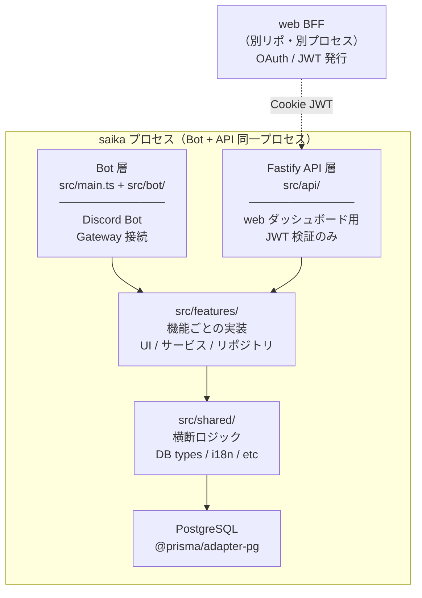

# アーキテクチャガイド

> Architecture Guide - コード設計・モジュール構成・設計パターンの解説

最終更新: 2026年9月25日

---

> DB は **PostgreSQL（`@prisma/adapter-pg` 経由）**（テーブル名は `guild_*_settings`、列名はスネークケース、JSON 配列は jsonb。全テーブルが親テーブル `guilds` へ FK を張る）。ディレクトリ構成は `src/{bot,api,features,shared}/`。Fastify API 層（`src/api/`）は実装・本番稼働済み。プロジェクト全体方針は [infra/docs/PROJECT_ARCHITECTURE.md](../../../infra/docs/PROJECT_ARCHITECTURE.md) を参照。

---

## 概要

saika は **Discord サーバー管理 Bot** です。
Web UI は別リポジトリ（ayasono-web）に分離されており、本リポジトリは Bot プロセス本体と、web ダッシュボードから呼ばれる Fastify API サーバー（同一 Node プロセス内で起動）を担当します。

### このドキュメントのスコープ

- 扱う内容: システム全体の構成、依存方向、レイヤ境界、モジュール責務
- 扱わない内容: 関数分割手順、命名/コメント細則、実装時のチェックリスト
- 実装細則は [IMPLEMENTATION_GUIDELINES.md](IMPLEMENTATION_GUIDELINES.md) を参照

---

## プロセス構成


```mermaid
graph TD
    subgraph saika["saika プロセス（Bot + API 同一プロセス）"]
        Bot["Bot 層<br>src/main.ts + src/bot/<br>─────────────<br>Discord Bot<br>Gateway 接続"]
        Api["Fastify API 層<br>src/api/<br>─────────────<br>web ダッシュボード用<br>JWT 検証のみ"]
        Features["src/features/<br>機能ごとの実装<br>UI / サービス / リポジトリ"]
        Shared["src/shared/<br>横断ロジック<br>DB types / i18n / etc"]
        DB["PostgreSQL<br>@prisma/adapter-pg"]
    end
    Web["web BFF<br>（別リポ・別プロセス）<br>OAuth / JWT 発行"]
    Bot --> Features
    Api --> Features
    Features --> Shared
    Shared --> DB
    Web -. "Cookie JWT" .-> Api
```

`src/main.ts` が Bot ログイン後に同一プロセス内で Fastify API を起動する（`API_ENABLED=false` で無効化可能）。両層とも `src/features/` のサービス・リポジトリを共有し、Discord UI と HTTP の薄い境界がそれぞれ呼び出す。詳細は [API 層（web ダッシュボード）](#api-層web-ダッシュボード) を参照。

**起動コマンド**:

```bash
# 開発
pnpm dev

# 本番
pnpm start
```

---

## ディレクトリ構成

```
src/
├── main.ts                    # エントリーポイント（Bot 起動）
│
├── bot/                       # Discord プラグイン層（Gateway・コマンド/イベントの配線）
│   ├── client.ts              # BotClient クラス（discord.js Client 拡張）
│   ├── commands/              # スラッシュコマンド定義（自動スキャン）
│   ├── events/                # Discord イベントハンドラ（自動スキャン）
│   ├── handlers/interactionCreate/  # インタラクション振り分け
│   ├── shared/                # Bot 層内の複数機能で共用するユーティリティ
│   ├── errors/                # インタラクションエラーハンドリング
│   ├── types/                 # Command 型など Bot 層の型
│   ├── utils/                 # Bot用ユーティリティ（commandLoader / eventLoader 等）
│   └── services/
│       └── botCompositionRoot.ts  # Composition Root（全サービスの初期化・DI）
│
├── features/<feature>/        # 機能ごとの実装（Discord UI〜設定サービス〜リポジトリを集約）
│   ├── commands/              #   コマンド実行ロジック
│   ├── handlers/              #   イベント境界・起動処理
│   │   └── ui/                #   Button/Select/Modal などUI境界
│   ├── services/              #   機能固有のビジネスロジック
│   ├── repositories/          #   機能固有のランタイムデータリポジトリ
│   ├── constants/             #   共通定数・CustomID 定義
│   ├── <feature>SettingsService.ts     # 設定サービス
│   ├── <feature>SettingsDefaults.ts    # デフォルト設定・正規化
│   └── <feature>SettingsRepository.ts  # 設定リポジトリ（シングルトンゲッター内包）
│   # 例外: guild-settings は guildCore/guildSettingsAggregate リポジトリ + persistence/serializers/usecases を内包
│
├── api/                       # Fastify API 層（web ダッシュボード用・Bot と同一プロセスで起動）
│   ├── server.ts              #   buildApiServer/startApiServer（cookie→cors→rate-limit→routes。認証は decorate）
│   ├── auth/                  #   JWT 検証（authenticate）・guildId 認可（guildAccess）。発行/refresh は持たない
│   ├── routes/                #   ルート定義（guilds / settings / sticky / reactionRoles / tickets / bot）
│   ├── features/<f>Resource.ts #  domain↔contract マッパー + create*Resource（純粋関数）
│   └── lib/                   #   httpError / discordMappers / time（date-fns ja）/ request / botGuild
│
└── shared/                    # Bot・features・Web で再利用する横断コード（逆依存しない）
    ├── config/                # 環境変数定義（Zod バリデーション）
    ├── database/types/        # ドメイン型・リポジトリインターフェース定義（実装は各 features/<f>/ に分散）
    ├── errors/                # エラーユーティリティ・グローバルハンドラ（BaseError 階層は @ayasono/shared/core）
    ├── locale/                # i18n（i18next）
    ├── scheduler/             # JobScheduler（cron + setTimeout。saika 固有だが横断利用のため維持）
    ├── constants/             # 横断定数（embedColors 等）
    └── utils/                 # logger（@ayasono/shared/core の createLogger を wiring）, prisma, serviceFactory 等
```

### 設計原則

依存方向は `src/main.ts` → `src/bot/` → `src/features/` → `src/shared/`（一方向）。

| ルール                                                          | 理由                                 |
| --------------------------------------------------------------- | ------------------------------------ |
| `src/bot/` → `src/features/` → `src/shared/` の一方向依存のみ許可 | レイヤの疎結合を維持                 |
| `src/shared/` は `bot` / `features` に依存しない                | 横断コードの独立性を保証             |
| `src/features/` は `src/bot/` に依存しない                      | Bot 層と API 層の双方から再利用（Discord 非依存の設定サービス・リポジトリ） |
| 機能の実装は `src/features/<機能名>/` に集約                    | UI・ロジック・データ層を機能単位で凝集 |

命名規則・ディレクトリテンプレート・import 規約の詳細は [IMPLEMENTATION_GUIDELINES.md](IMPLEMENTATION_GUIDELINES.md) を参照してください。

---

## Discord Bot 設計

### Gateway Intents

```typescript
// src/bot/client.ts
intents: [
  GatewayIntentBits.Guilds, // サーバー情報・チャンネル情報
  GatewayIntentBits.MessageContent, // メッセージ本文の読み取り（Bump検知に必須）
  GatewayIntentBits.GuildMessages, // サーバー内メッセージイベント
  GatewayIntentBits.GuildMembers, // メンバー参加・退出イベント（MemberLog 用）
  GatewayIntentBits.GuildVoiceStates, // VC 参加・退出イベント（AFK移動・VAC 用）
];
```

> **注意**: `MessageContent` と `GuildMembers` は Discord Developer Portal での **Privileged Intents 有効化**が必要です。

### Bot パーミッション

Bot の招待時は **Administrator は要求せず、最小権限セット**を付与します。招待リンクの権限は [`INVITE_PERMISSIONS`](../../src/api/routes/bot.ts) で定義し、各機能の実 API 呼び出しに必要な個別権限のみを列挙します（ViewChannel / SendMessages / EmbedLinks / ReadMessageHistory / ManageMessages / ManageChannels / ManageRoles / MoveMembers / Connect / KickMembers / ManageGuild / ManageThreads / SendMessagesInThreads の13権限）。`MentionEveryone` は最小権限維持のため含めない（@everyone/@here 等の通知は飛ばないがメッセージ投稿自体は成功する）。

> `SendMessagesInThreads` が必要なのは **Bump 検知だけ**。インタラクション応答（reply / editReply / followUp）は interaction トークン経由のためチャンネルの送信権限を要求せず、スレッド内でコマンドを実行しても応答は返る。Bump 検知は messageCreate 起点の `channel.send()` なので、この権限が無いとスレッド内の Bump で予約パネルとリマインドが送れない。
>
> 一方、ticket / reaction-role のパネルは**スレッドへ設置させない**（[`rejectThreadChannel`](../../src/bot/shared/channelGuards.ts) で拒否）。権限の問題ではなく、スレッドはアーカイブされるとチャンネル一覧から消えるため、恒久設置物を置くと管理者が見失うという設計判断。

> チャンネル作成時の overwrite には昇格権限ビット（ManageChannels / ManageRoles）を含めない。Administrator を持たない Bot が overwrite で昇格ビットを付与しようとすると `403 Missing Permissions` になるため、これらはギルド全体の権限で保持する。

### イベントハンドラ

| イベント          | 用途                                                         |
| ----------------- | ------------------------------------------------------------ |
| clientReady       | Bot 起動時の初期化処理                                       |
| interactionCreate | スラッシュコマンド・ボタン・モーダル等のインタラクション処理 |
| messageCreate     | Bump 検知・Sticky Message 再送信                             |
| messageDelete     | チケットパネル・リアクションロールパネルの自己修復           |
| voiceStateUpdate  | VC自動募集・VAC の同期処理（VC自動募集を先に await する）    |
| guildMemberAdd    | メンバー参加ログ通知                                         |
| guildMemberRemove | メンバー退出ログ・退出ユーザーの記録削除                     |
| guildMemberUpdate | 未承認自動キックの対象ロール解除の検知                       |
| channelDelete     | 削除チャンネル関連設定のクリーンアップ                       |
| roleDelete        | 削除ロールの Bump リマインダー設定除去                       |
| guildCreate       | 参加ログ・**親レコード（`guilds`）の作成と削除予約の取り消し**・稼働サーバー数のプレゼンス更新・**オーナーへの導入／再導入 DM**（日英併記・送信失敗は握りつぶす） |
| guildDelete       | Bot 退出時のジョブ停止（`stopGuildJobsUsecase` 経由）＋**猶予後のデータ削除の予約** |

### BotClient クラス

`discord.js` の `Client` を拡張し、以下を追加しています：

```typescript
class BotClient extends Client {
  commands: Collection<string, Command>; // 登録済みコマンド
  cooldownManager: CooldownManager; // クールダウン管理
}
```

### コマンド・イベントの自動ロード

`src/bot/commands/` と `src/bot/events/` 内のファイルは、**バレルファイルなし**で自動ロードされます。

| ローダー                         | スキャン対象            | 判定条件                  |
| -------------------------------- | ----------------------- | ------------------------- |
| `src/bot/utils/commandLoader.ts` | `src/bot/commands/*.ts` | `data` + `execute` を持つ |
| `src/bot/utils/eventLoader.ts`   | `src/bot/events/*.ts`   | `name` + `execute` を持つ |

**コマンド追加手順**: `src/bot/commands/<name>.ts` に `Command` 型を満たすオブジェクトをエクスポートするだけで、配列への手動追加は不要です。

> **tsup `splitting` と `import.meta.dirname` の注意点**
>
> tsup の `splitting: true` が有効なとき、複数エントリーから参照される関数は `dist/chunk-XXXXXXXX.js` のような共有チャンクに移動する。この場合、関数内の `import.meta.dirname` はチャンクの置き場所（`dist/` 直下）を返すため、ローダー内でパスを解決すると実際のディレクトリ（`dist/bot/commands/`）とずれる。
>
> これを防ぐため、`loadCommands()` と `loadEvents()` は **ディレクトリパスを引数で受け取る**設計になっている。エントリの `main.ts`（`dist/main.js` にコンパイルされるため `import.meta.dirname` が確実に `dist/` を返す）から、`bot/commands` / `bot/events` を付けた正しいパスを渡す：
>
> ```typescript
> // src/main.ts
> const commands = await loadCommands(resolve(import.meta.dirname, "bot/commands")); // → dist/bot/commands/
> const events = await loadEvents(resolve(import.meta.dirname, "bot/events")); // → dist/bot/events/
> ```
>
> ローダー関数内で `import.meta.dirname` を使ってパスを解決してはいけない。将来新しいローダーを追加する場合も同様に呼び出し元からパスを渡すこと。

```typescript
// src/bot/commands/hello.ts
export const helloCommand: Command = {
  data: new SlashCommandBuilder().setName("hello").setDescription("..."),
  async execute(interaction) { ... },
};
```

### コマンドの型インターフェース

```typescript
interface Command {
  data: SharedSlashCommand;
  execute: (interaction: ChatInputCommandInteraction) => Promise<void>;
  autocomplete?: (interaction: AutocompleteInteraction) => Promise<void>;
  cooldown?: number; // 秒単位（省略時はクールダウンなし）
}
```

---

## API 層（web ダッシュボード）

`src/api/` は web ダッシュボード（`saika-dash.sonozaki.net`）の **per-guild バックエンド**となる Fastify API。Bot と同一プロセスで起動し（`src/main.ts` が Bot ログイン後に `startApiServer` を呼ぶ・`API_ENABLED=false` で無効化可能）、`src/features/` の設定サービス・リポジトリを Bot 層と共有する。

### 認証（web BFF 集約・saika は検証のみ）

認証は **web BFF**（web リポの別プロセス）に集約し、saika は **JWT 検証のみ**を行う。saika は Discord を呼ばず、OAuth も refresh トークンも持たない。

- **JWT_SECRET を web BFF と共有**（HMAC-SHA256）。web BFF がログイン時に発行する Cookie のセッション JWT を saika が検証する。
- `auth/authenticate.ts`: Cookie の JWT を検証して `request.authUser`（`SessionClaims`）を確立。失効時は **401**（refresh はしない＝BFF 側の責務）。
- `auth/guildAccess.ts`: 対象 `guildId` が `claims.guilds`（ユーザーが管理可能なギルド ID 配列）に含まれるかを判定し、無ければ **403**。続けて Bot がそのギルドに参加しているか（ゲートウェイのキャッシュ）を判定し、居なければ **404**（`lib/botGuild.ts` の `requireBotGuild`）。`claims.guilds` には Bot 未参加のギルドも入るため、これが無いと親行の無いギルドへの書き込みが FK 違反の 500 になり、退出後の猶予中のギルドには効かない設定を書けてしまう。判定は権限が先（逆にすると管理権限の無いギルドの参加有無が 403/404 の違いで漏れる）。
- 一覧（Bot 未参加ギルドの名前/アイコン）は Discord を呼べないため **web BFF へ移管**。saika は per-guild ルート + `GET /api/guilds/joined`（参加ギルド ID の照会）のみ。

### レイヤ構成

| 層 | 役割 |
| --- | --- |
| `routes/*.ts` | HTTP 境界（薄い）。認可デコレータを適用し、Resource とサービスを呼ぶ |
| `features/<f>Resource.ts` | domain ↔ API contract の純粋マッパー + `create*Resource`。アダプタは Composition Root の getter を各メソッド内で遅延取得 |
| `src/features/<f>` | Bot 層と共有する設定サービス・リポジトリ（Discord 非依存） |
| `lib/` | `httpError`（`ApiHttpError` + `toErrorResponse`）/ `discordMappers` / `time`（date-fns ja）/ `request` / `botGuild`（`requireBotGuild`: Bot 未参加なら 404） |

サーバー構築は `server.ts` の `buildApiServer`（テストは `app.inject()` で直接叩ける）。プラグインの登録順は cookie → cors → rate-limit → `apiRoutes`(`/api`) で、リクエストのフックもこの順に走る。認証（`authenticate` / `requireGuildAccess`）はミドルウェアではなく `decorate` で生やし、各ルートが `preHandler` として使う。

`trustProxy` は `true` ではなく、**信頼する直前ホップのアドレス範囲**（`src/api/constants.ts` の `TRUSTED_PROXY_RANGES`）で指定する。`true` だと `X-Forwarded-For` の最左、つまり攻撃者が送った値が `request.ip` になり、レート制限をすり抜けられる。範囲の根拠と経路は [DEPLOYMENT.md](DEPLOYMENT.md#web-api-の到達経路) を参照。**クライアント IP は `request.ip` だけを使い、`X-Forwarded-For` / `CF-Connecting-IP` を直接読まない**（取得口を1つに保つ）。この挙動は `tests/unit/api/server.test.ts` の回帰テストで固定している。

### エンドポイント概要

機能別設定 7 種（config / afk / vac / member-log / bump / vc-auto-recruit / unverified-kick）の CRUD、コレクション 3 種（sticky / reaction-role / ticket・パネル投稿副作用つき）、ギルド概要（overview）・Discord リソース（channels / roles / members）・`GET /api/bot`・`GET /api/guilds/joined`・全設定リセット `POST /api/guilds/:id/reset-all`。

### 関連環境変数

`API_ENABLED` / `API_HOST` / `API_PORT` / `WEB_ORIGIN`（CORS 許可オリジン・カンマ区切り）/ `JWT_SECRET`（本番必須・BFF と共有）。

> 認証・CORS の横断方針は [PROJECT_ARCHITECTURE.md](../../../infra/docs/PROJECT_ARCHITECTURE.md)、本番デプロイ手順・知見（SSL / Tunnel / Coolify compose / ポート）は [web/docs/DEPLOYMENT.md](../../../web/docs/DEPLOYMENT.md) を参照。

---

## データベース設計

### 接続管理

`setPrismaClient()` / `getPrismaClient()` / `requirePrismaClient()` をモジュールレベルで管理します。
`global` 変数を使わず、モジュールスコープの変数で Prisma Client を保持します。

```typescript
// 起動時に一度だけ登録
setPrismaClient(prisma);

// 利用側（必ず存在する前提）
const prisma = requirePrismaClient(); // 存在しない場合は Error をスロー

// 利用側（存在しない可能性あり）
const prisma = getPrismaClient(); // null の場合あり
```

### スキーマ構成

機能ごとに独立したテーブルを持ちます。`GuildSettings` テーブルは共通設定（locale 等）のみを保持し、機能設定は専用テーブルに分離されています。`Guild` が全テーブルの親で、機能テーブルは例外なくここへ FK を張ります。

| テーブル                  | 用途                                       |
| ------------------------- | ------------------------------------------ |
| `Guild`                     | ギルドの親レコード（導入日時・削除予定日時）。全機能テーブルの FK 先 |
| `GuildSettings`             | ギルド共通設定（locale 等）                |
| `GuildAfkSettings`          | AFK 機能設定                               |
| `GuildBumpReminderSettings` | Bump リマインダー設定                      |
| `GuildMemberLogSettings`    | メンバーログ設定                           |
| `GuildVacSettings`          | VC 自動作成設定                            |
| `GuildVcAutoRecruitSettings` | VC 自動募集設定                            |
| `GuildUnverifiedKickSettings` | 未承認ユーザー自動キック設定             |
| `GuildUnverifiedKickWarn` | 未承認キックの警告記録（guildId + userId 複合PK） |
| `BumpReminder`            | Bump リマインダー記録（スケジュールデータ） |
| `StickyMessage`           | 固定メッセージ記録                         |
| `GuildTicketSettings`       | チケット機能設定（カテゴリ・スタッフロール・パネル情報） |
| `Ticket`                  | チケットレコード（ステータス・作成者・自動削除タイマー） |
| `GuildReactionRolePanel`  | リアクションロールパネル設定（ボタン・モード・表示設定） |

JSON 配列・オブジェクトフィールド（`mentionUserIds`, `triggerChannelIds`, `buttons`, `staffRoleIds`, `embedData` 等）は PostgreSQL の `jsonb` 型でネイティブに保存し、Prisma が配列・オブジェクトのまま読み書きします（`JSON.parse`/`stringify` による変換は不要）。

### 退出時データのライフサイクル

Bot をサーバーから外しても、データはその場では消えません。**猶予30日**を置いてから削除します。「Bot の再招待は破壊的操作ではない」という利用者の期待に実装を合わせるためです（2026-09-23 決定・猶予日数は `GUILD_DELETION_GRACE_DAYS`）。

| タイミング | 処理 |
| --- | --- |
| `guildDelete` | ジョブを即停止し、`guilds.scheduled_deletion_at` に30日後を書く。**データは消さない** |
| `guildCreate` | 親行を作り、削除予約を取り消す。猶予内の再導入なら設定はそのまま復活する |
| 起動時（`clientReady`） | 照合を1回実行し、日次ジョブを登録する |
| 再 IDENTIFY の後（`ShardReady`） | 照合を実行する（切断中に起きた導入・退出を日次ジョブまで待たない） |
| 日次ジョブ（毎日 4 時 JST） | 照合を実行する（`GUILD_DELETION_JOB_ID`） |

**照合**（`reconcileGuildsUsecase`）は、DB の `guilds` と Bot の参加状況（**REST の `GET /users/@me/guilds` で取得**）を突き合わせて予約を正しい状態へ揃えます。

1. 参加中のギルドの親行を補完する
2. 参加中のギルドの削除予約を取り消す
3. 参加していないのに予約の無いギルドへ30日後の削除を予約する（既存の予約は延ばさない）
4. 猶予切れのギルドを削除する

> **ジョブの停止だけは遅らせない。** 参加していないギルドのタイマーが生きていると、投稿・削除を試み続けてエラーログを吐くため。遅らせるのはデータの削除だけです。
>
> **予約をイベントだけで管理しない。** `guildCreate` / `guildDelete` は Bot の停止中・切断中に起きた参加・退出では飛ばないため、イベントだけに頼ると「参加中のギルドのデータを消す」か「退出したギルドのデータが永久に残る」のどちらかになります。イベントは即時反映の近道で、正しさは照合で担保します。
>
> **照合では「予約の取り消し」を「削除」より必ず先に行う。** 順序を逆にすると、停止中に外されて入れ直されたギルドのデータを期限切れとして消してしまいます。
>
> **参加状況はゲートウェイのキャッシュではなく REST で取る。** discord.js は再 IDENTIFY 後の READY で消えたギルドをキャッシュから取り除かないため、キャッシュを使うと切断中に外されたギルドが参加中に見え続け、再起動するまで削除予約が入りません。
>
> **参加ギルドが0件のときは予約を入れない。** 0件は設定ミス（ギルドに参加していない別アプリのトークンで本番 DB に繋いだ等）の可能性が高く、全ギルドを一斉に予約してしまうのを避けるためです（API の失敗は例外になり、照合そのものが中止されます）。
>
> **削除の直前にもう一度ジョブを止める。** 猶予中に Bot を再起動すると `restoreBumpRemindersOnStartup` が pending レコードからタイマーを組み直すため、「タイマー解除 → DB 削除」の順序を保つ必要があります。
>
> **既知の制限。**
>
> - Bot の停止中・切断中に導入・再導入されたギルドのオーナーには導入時／再導入時 DM が届きません（照合は親行と予約を黙って直すだけ。照合から DM を送ると、初回リリースで設定の無い既存ギルドにも親行が作られ、一斉送信になるため送らない）。
> - 猶予内に再導入しても、退出時に止めたタイマーは戻りません（→ TODO「タイマー / スケジューラ実装の整理」）

即時削除が要るときは `/guild-settings reset-all`（`purgeGuildDataUsecase`）を使います。この経路は猶予を挟みません。

### Repository パターン

データベースへのアクセスはすべて Repository クラスを経由します。
テスト時は Repository インターフェースをモック注入することで DB 依存を排除できます。

**設定リポジトリ（`src/features/<feature>/<feature>SettingsRepository.ts`、guild-settings は `src/features/guild-settings/`）**:

機能ごとの設定テーブルに対応するスタンドアロンリポジトリです（インターフェース定義は `src/shared/database/types/` に集約）。各リポジトリは個別のインターフェースを実装し、シングルトンゲッター（例: `getAfkSettingsRepository(prisma)`）で取得します。

```
GuildCoreRepository              ← ギルド設定コアCRUD（IGuildCoreRepository）
GuildRegistryRepository          ← ギルド親レコードの登録（IGuildRegistryRepository）
GuildSettingsAggregateRepository   ← 全設定一括操作（IGuildSettingsAggregateRepository）
AfkSettingsRepository              ← AFK設定（IAfkSettingsRepository）
BumpReminderSettingsRepository     ← Bumpリマインダー設定（IBumpReminderSettingsRepository）
MemberLogSettingsRepository        ← メンバーログ設定（IMemberLogSettingsRepository）
VacSettingsRepository              ← VAC設定（IVacSettingsRepository）
VcAutoRecruitSettingsRepository    ← VC自動募集設定（IVcAutoRecruitSettingsRepository）
UnverifiedKickSettingsRepository   ← 未承認自動キック設定（IUnverifiedKickSettingsRepository）
UnverifiedKickWarnRepository       ← 未承認キック警告記録（IUnverifiedKickWarnRepository）
TicketSettingsRepository           ← チケット機能設定（IGuildTicketSettingsRepository）
ReactionRolePanelRepository      ← リアクションロールパネル（IReactionRolePanelRepository）
```

> **親テーブル `Guild` と外部キー制約**（2026-09-24 導入）。`guildId` を持つ13モデルはすべて `Guild` へ `@relation(onDelete: Cascade)` を張っています。狙いは2つで、①Bot が把握しているギルド（参加中か猶予中）を `guilds` の1テーブルで列挙でき、ギルド単位の状態（導入日時・削除予約）を置ける場所を作ること ②ギルド単位の後始末を「親行を1つ消す」に集約することです。
>
> **`guild_settings` 行の欠落は親テーブルでは解消しません。** この行は `/guild-settings set-locale` か `set-error-channel` を実行したときだけ作られ、実測でデータを持つギルドの67%に行がありませんでした。親テーブル導入後も同じなので、`guild_settings` 行の有無を「ギルドの有無」の代わりに使わないでください（使うべきは `guilds` 行）。**「設定の有無」はどちらの行でも分かりません。** `guilds` 行は参加中の全ギルドに設定の有無と関係なく作るためで、設定の有無は各機能テーブルを見て判断します。
>
> FK があるため、**親行が無いギルドではどの機能の設定も保存できません**（FK 違反になる）。親行は `GuildRegistryRepository` の2経路で担保します。`handleGuildCreate`（参加時）と、起動時・日次の照合（Bot 停止中に追加されたギルドは `guildCreate` が飛ばないため。→ [退出時データのライフサイクル](#退出時データのライフサイクル)）。
>
> `/guild-settings reset-all` の `deleteAllSettings()` も、テーブルを個別に列挙する実装をやめて**親行を消して同じ `joinedAt`・削除予約で作り直す**形にしています（Bot はまだ参加しているため、登録そのものは残す必要がある）。新しいギルド単位テーブルは FK を張るだけで自動的に削除対象になります。

**ランタイムデータリポジトリ（`src/features/<feature>/repositories/`）**:

設定以外のランタイムデータ（レコード・状態管理）を扱うリポジトリです。

```
BumpReminderRepository   ← BumpReminder テーブルの CRUD
StickyMessageRepository  ← StickyMessage テーブルの CRUD
TicketRepository         ← Ticket テーブルの CRUD
```

### Composition Root と DI

`src/bot/services/botCompositionRoot.ts` がすべてのサービス・リポジトリを初期化します。
各サービスは `createBotServiceAccessor<T>()` で生成した getter/setter ペアでモジュールレベルに保持されます。

```typescript
// 起動時に一度だけ初期化
initializeBotCompositionRoot(prisma);

// 利用側（ハンドラーから呼び出す）
const service = getBotBumpReminderSettingsService();
```

未初期化状態で getter を呼ぶと即座に `Error` がスローされるため、初期化漏れを起動時に検出できます。

---

## スケジューラー設計

`JobScheduler` は2種類のジョブをサポートします。

| 種別           | メソッド          | 仕組み                  | 用途                |
| -------------- | ----------------- | ----------------------- | ------------------- |
| 繰り返しジョブ | `addJob()`        | node-cron               | 定期実行タスク      |
| 1回限りジョブ  | `addOneTimeJob()` | setTimeout + `.unref()` | Bump リマインダー等 |

`setTimeout` に `.unref()` を呼び出しているため、**タイマーが残っていても Node.js プロセスは正常終了**できます。

`clientReady` で登録される繰り返しジョブは以下の2本です。

| ジョブ ID | 頻度 | 用途 |
| --- | --- | --- |
| `unverified-kick:daily-check` | 毎時 0 分 | 未承認ユーザー自動キック（per-guild の timezone / runHour で絞り込み） |
| `guild-settings:deletion-sweep` | 毎日 4 時（Asia/Tokyo） | ギルド登録の照合と猶予切れギルドのデータ削除（→ [退出時データのライフサイクル](#退出時データのライフサイクル)） |

`BumpReminderManager` は `JobScheduler` をラップし、リマインダーの DB 永続化と再起動時の復元を担います。

```
Bot 起動
  └─ clientReady イベント
       └─ BumpReminderManager.restorePendingReminders()
            ├─ DB から status=pending のリマインダーを取得
            ├─ scheduledAt が過去 → 即時実行
            └─ scheduledAt が未来 → setTimeout で再スケジュール
```

リマインダーはメモリ上の `Map` に **`"guildId:serviceName"` の複合キー**で登録されます（同一ギルドで Disboard / Dissoku が独立して共存できるようにするため）。したがってギルド単位でまとめて解除する場合は、完全一致で引く `cancelReminder(guildId)` ではなく **`BumpReminderManager.cancelAllForGuild(guildId)`** を使う必要があります。前者は複合キーにヒットしません。

### ギルド単位の後始末

ギルドのデータを消す経路は2つあり（`/guild-settings reset-all` / Web API `POST /:guildId/reset-all`）、いずれも **`purgeGuildDataUsecase`**（`src/features/guild-settings/usecases/purgeGuildDataUsecase.ts`）に集約されています。

`guildDelete`（Bot の退出・キック・BAN）は**データを消しません**。`stopGuildJobsUsecase` を呼んでインメモリのタイマー（チケット自動削除ジョブ・Bump リマインダー）を止めるだけで、DB には一切触れません。Bot を外しただけで不可逆に設定が消えるのは「再招待は破壊的操作ではない」という利用者の期待に反するため、2026-09-23（v3.1.3）に即時削除をやめました。

```
purgeGuildDataUsecase(deps, guildId)
  ├─ 1. チケット自動削除ジョブの解除（jobScheduler.removeJob）
  ├─ 2. Bump リマインダーの解除（cancelAllForGuild）
  └─ 3. DB 一括削除（deleteAllSettings）
```

> **順序に意味があります。** DB 行を先に消すとインメモリタイマーが生き残って投稿が実行され、その後の `updateStatus` が P2025 で失敗してログが荒れます。**タイマー解除 → DB 削除**の順を必ず守ってください。

`GuildSettingsService` は cross-feature 依存を持たない設計のため、この usecase は依存を引数で受け取り、呼び出し側が composition root のゲッターから解決します。

---

## エラーハンドリング設計

### カスタムエラークラス一覧

`BaseError` 階層は `@ayasono/shared/core` から提供されます（全 ayasono アプリ共通）。すべて `BaseError` を継承しています。

| クラス               | statusCode | 用途                     |
| -------------------- | ---------- | ------------------------ |
| `ValidationError`    | 400        | 入力値バリデーション失敗 |
| `PermissionError`    | 403        | 権限不足                 |
| `NotFoundError`      | 404        | リソースが見つからない   |
| `TimeoutError`       | 408        | タイムアウト             |
| `RateLimitError`     | 429        | レート制限               |
| `ConfigurationError` | 500        | 設定ミス（環境変数等）   |
| `DatabaseError`      | 500        | DB 操作失敗              |
| `DiscordApiError`    | 500        | Discord API エラー       |

### `isOperational` フラグ

`BaseError` は `isOperational: boolean` を持ちます。

| 値                  | 意味                                       | ログレベル |
| ------------------- | ------------------------------------------ | ---------- |
| `true` (デフォルト) | 想定済みの運用エラー（ユーザー操作ミス等） | `warn`     |
| `false`             | プログラミングエラー・バグ                 | `error`    |

`isOperational: false` のエラーはバグの可能性があるため、本番環境ではユーザーに詳細を返しません。

### グローバルエラーハンドラ

`setupGlobalErrorHandlers()` を起動時に呼び出すと、以下がキャッチされます。

```
process.on('unhandledRejection') → ログ出力
process.on('uncaughtException')  → ログ出力 + process.exit(1)
process.on('warning')            → ログ出力
```

`setupGracefulShutdown()` で `SIGTERM` / `SIGINT` 時に Prisma 切断 + Botログアウトを行います。

---

## BUMP_REMINDER_TEST_MODE フラグ

`BUMP_REMINDER_TEST_MODE=true` を設定すると、Bump リマインダーの待機時間が **120分 → 1分** に短縮されます。
本番環境での動作確認や E2E テストに使用します。

```bash
# .env
BUMP_REMINDER_TEST_MODE=true
```

```typescript
// src/features/bump-reminder/constants/bumpReminderConstants.ts
export function getReminderDelayMinutes(): number {
  return env.BUMP_REMINDER_TEST_MODE ? 1 : 120;
}
```

> **注意**: `BUMP_REMINDER_TEST_MODE=true` は本番環境では使用しないでください。

---

## 関連ドキュメント

- [DEPLOYMENT.md](DEPLOYMENT.md) - Coolify デプロイフロー
- [I18N_GUIDE.md](I18N_GUIDE.md) - 多言語対応
- [TESTING_GUIDELINES.md](TESTING_GUIDELINES.md) - テスト方針
- [PROJECT_ARCHITECTURE.md](../../../infra/docs/PROJECT_ARCHITECTURE.md) - プロジェクト全体構成・認証/CORS 横断方針
- [web/docs/DEPLOYMENT.md](../../../web/docs/DEPLOYMENT.md) - ダッシュボード本番デプロイ手順・知見

